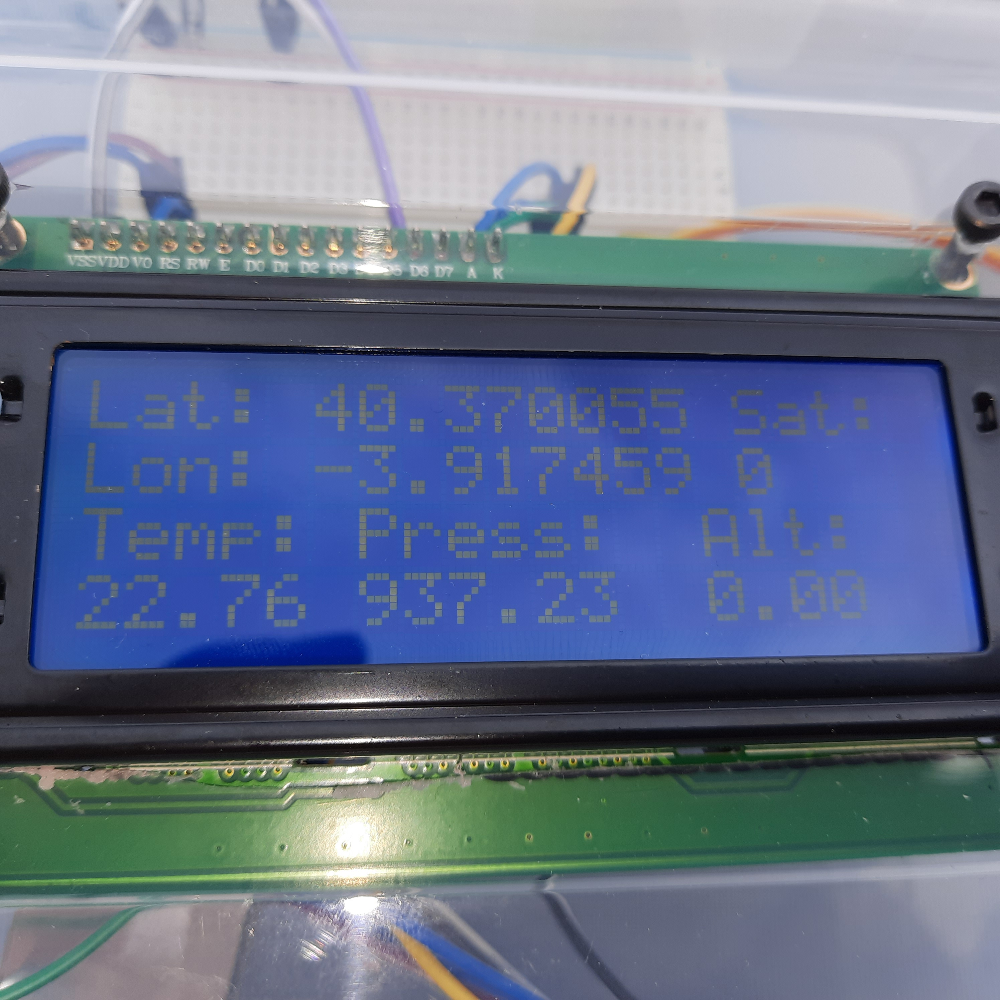

# gps-lcd-bmp280-map
How to build a box with GPS location sensor, LCD display, BMP280 temperature and atmospheric pressure sensor, and show it all on an OpenStreetMap map

Building instructions are available at my blog, see https://www.sabulo.com

The map feature of this device is available in two versions, one for single box and anoher for the situation where you have multiple boxes to show on map.

The box has a display to show the location data, altitude, number of satellites, temperature, and atmospheric pressure. 

This data is sent to a text file on the web every ten seconds.

The map PHP files on the web server then display either a single box location on the map, or, if you have more than one box, their locations.

The INO file needs to be edited to include your URLs.

